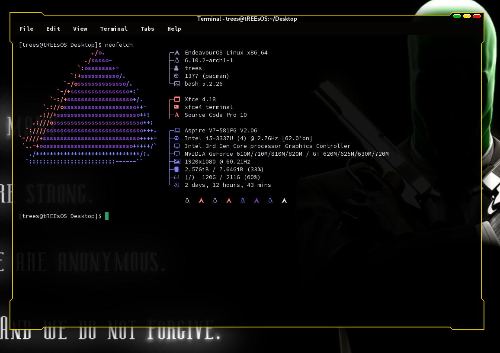

<!---
This document is the README.md for a code repoitory hosted free on GitHub.
This document is from the repository "CyberWM-Dark-Yellow" by User: "tREEs-Repos"
This document will be shown on the main page of the repository.
It is written with Markdown Formatting.

Project Directory URL:
https://github.com/tREEs-Repos/CyberWM-Dark/tree/main/CyberWM-Dark-Yellow
--->

<!--- Start the README with some markdown badges Indicating the Supported Platforms --->


<!--- Preview Image as start of README --->

# CyberWM-Dark "Yellow" XFCE WM Theme

<!--- Interactive Table of Contents leading to Headers in the Document --->
### Table of Contents
- [Description](#project-description)
- [Installation](#installation)
- [License](#license)
- [Acknowledgements](#acknowledgements)
- [Bugs and Feedback](#bugs-and-feedback)

___

### Project Description

The 'Cyber-WM Dark' theme collection is a variety of dark-mode styles for the XFCE Window Manager. This repository is for
the bold yellow theme, code named: "Yellow".

Experience a unique GUI feel with CyberwMs use of Shadow Effects which appear to change your Window shape entirely when in 
windowed mode. 

CyberWM-Dark-Yellow is ported from 'ghost-dark', a Window Manager style by [Purnomo Shinigami](https://www.xfce-look.org/u/purnomoshinigami).

It is originally inspired by the ColdSteel Oroborous Theme. 
___

### Installation
To install this  theme we use a combination of Gits 'sparse-checkout' feature combined with the `git` tool.

In this example we are installing themes to the most common directory: `/usr/share/themes`

1. First Create a Directory for you to use for handling the source files.
   ```
   mkdir -v my_color/
   ```

2. Initialize git within your workspace.
   ```
   cd my_color/
   git init
   ```
   You will see what looks like an error for initializing an empty repository. Ignore this.

3. Add the Remote URL for the Cyber-WM Themes source code.
   ```
   git remote add origin https://github.com/tREEs-Repos/CyberWM-Dark.git
   ```

4. Fetch all of the objects in the Repository, but don't check them out.
   ```
   git fetch origin
   ```
   If this command is successful you will see output like as follows:
   ```
   remote: Enumerating objects: 356, done.
   remote: Counting objects: 100% (356/356), done.
   remote: Compressing objects: 100% (111/111), done.
   remote: Total 356 (delta 259), reused 320 (delta 242), pack-reused 0 (from 0)
   Receiving objects: 100% (356/356), 3.22 MiB | 5.96 MiB/s, done.
   Resolving deltas: 100% (259/259), done.
   ```

6. Enable 'sparse-checkout' to check out only specific directories.
   ```
   git sparse-checkout init --cone
   ```

7. Checkout the theme directory from the repo.
   ```
   git sparse-checkout set CyberWM-Dark-Yellow/
   ```

8. Now check out the branch that you want. (Always 'main' for CyberWM.)
   ```
   git checkout main
   ```

   You should expect to see the following output:
   ```
   branch 'main' set up to track 'origin/main'.
   Switched to a new branch 'main'
   ```
   
9. Check your workspace to ensure you have the color of your choice.
    ```
    ls -al path/to/my_color/
    ```
    If you followed all the steps correctly you will see your downloaded Theme files.

10. Ship the theme config to the XFCE Themes directory.

    You have two options for moving the files.
    You can either use `mv` to move all the Downloaded Files directly.

    This command may require `sudo` depending on your setup / needs.
    ```
    sudo mv -v CyberWM-Dark-Yellow/ /usr/share/themes
    ```
    If the command is successful you will see the similar output:
    ```
    renamed 'CyberWM-Dark-Yellow/' -> '/usr/share/themes/CyberWM-Dark-Yellow'
    ...
    ```

    Or you can use 'copy', `cp` to copy the files and preserve the source.

    This command may require `sudo` depending on your setup / needs.
    ```
    sudo cp -rv CyberWM-Dark-Yellow/ /usr/share/themes
    ```
    If the command is successful you will see similar output:
    ```
    'CyberWM-Dark-Yellow/' -> '/usr/share/themes/CyberWM-Dark-Yellow'
    ...
    ```

11. Your theme is now Installed successfully and ready for use.

    You should be able to activate it from the terminal with the `xfconf` package.

    ```
    xfconf-query -c xfwm4 -p /general/theme -s "CyberWM-Dark-Yellow"
    ```

    If installation was successful your Window Manager Theme will change instantly.

___
<!--- Including a copy of the Creative Commons Zero License in the README for Transparency --->
### License
CyberWM-Dark-Yellow is Provided under the Creative Commons Zero License. 
A copy of the license is included below in full:

```
________________________________________________________________________________________
This license description applies to: "CyberWM-Dark XFCE Window Manager Themes" by tREEs
The full repository is available at this URL: https://github.com/tREEs-Repos/CyberWM-Dark
_________________________________________________________________________________________

____________________________________________________
CC0 1.0 Universal (CC0 1.0) Public Domain Dedication
____________________________________________________

The person who associated a work with this deed has dedicated the work to the public domain 
by waiving all of his or her rights to the work worldwide under copyright law, including all 
related and neighboring rights, to the extent allowed by law.

You can copy, modify, distribute, and perform the work, even for commercial purposes, all 
without asking permission. Full Copy of the legal code: 

https://creativecommons.org/publicdomain/zero/1.0/legalcode

By using this code repository you agree to be bound by the conditions of this license.
_________________________________________________________________________________________
```
A copy of the License will be cloned with this Project Directory. It is available .
___

### Acknowledgements

**Purnomo Shinigami** - An Indonesian user on XFCE Look.
He has some amazing Window Manager themes that seem to turn up on all my XFCE Builds.
Support him by checking out his  Account and seeing if theres anything you like.

He is also on GitHub and has a few  here as well.

**XFCE-Look.org** - 
A well known, leading source of configurations for XFCE, GTK, Compix, Beryl / Emerald Themes and more.
Support the website by checking it out and seeing if theres anything you like.
The XFCE-Look website is linked directly .

___

### Bugs and Feedback

Issues / Errors with this Repository? Reach out here via Github.

Feedback? Also feel free to reach out here via Github. Your input is always appreciated!

I am always open to requests to refactor and redesign this repository if you have a better system.

___
