<!---
This document is the README.md for a code repoitory hosted free on GitHub.
This document is from the repository "CyberWM-Dark" by User: "tREEs-Repos"
This document will be shown on the main page of the repository.
It is written with Markdown Formatting.

Repository URL:
https://github.com/tREEs-Repos/CyberWM-Dark/
--->

<!--- Start the README with some markdown badges Indicating the Supported Platforms --->


<!--- Display the README banner image as the document Title --->
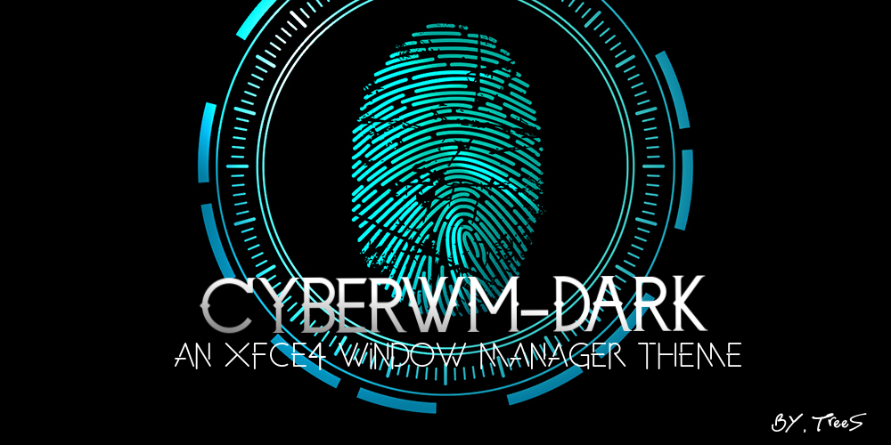

<!--- Interactive Table of Contents leading to Headers in the Document --->
## Table of Contents
- [Description](#project-description)
- [Themes And Previews](#themes-and-previews)
- [Installation](#installation)
- [License](#license)
- [Acknowledgements](#acknowledgements)
- [Bugs and Feedback](#bugs-and-feedback)

<!--- A Brief Summary of the Project and what functionality it provides / goal it accomplishes --->
### Project Description:
The 'Cyber-WM Dark' theme collection is a variety of dark-mode styles for the XFCE Window Manager. This repository comes with 11 
color styles to choose from, making it even more likely you'll find a color to make your build stand out.

Experience a unique GUI feel with CyberwMs use of Shadow Effects which appear to change your Window shape entirely when in 
windowed mode. 

CyberWM is ported from 'ghost-dark', a Window Manager style by [Purnomoshinigami](https://www.xfce-look.org/u/purnomoshinigami).

It is originally inspired by the ColdSteel Oroborous Theme. 

<!--- Preview Images of each Theme Color. --->
<!--- Preview Images are stored in the root directory of each individual Theme. --->
## Themes and Previews
This theme collection comes in 11 color combinations. These are listed below, in the order they appear in the Repository files.

* CyberWM-Dark-DeepBlue
  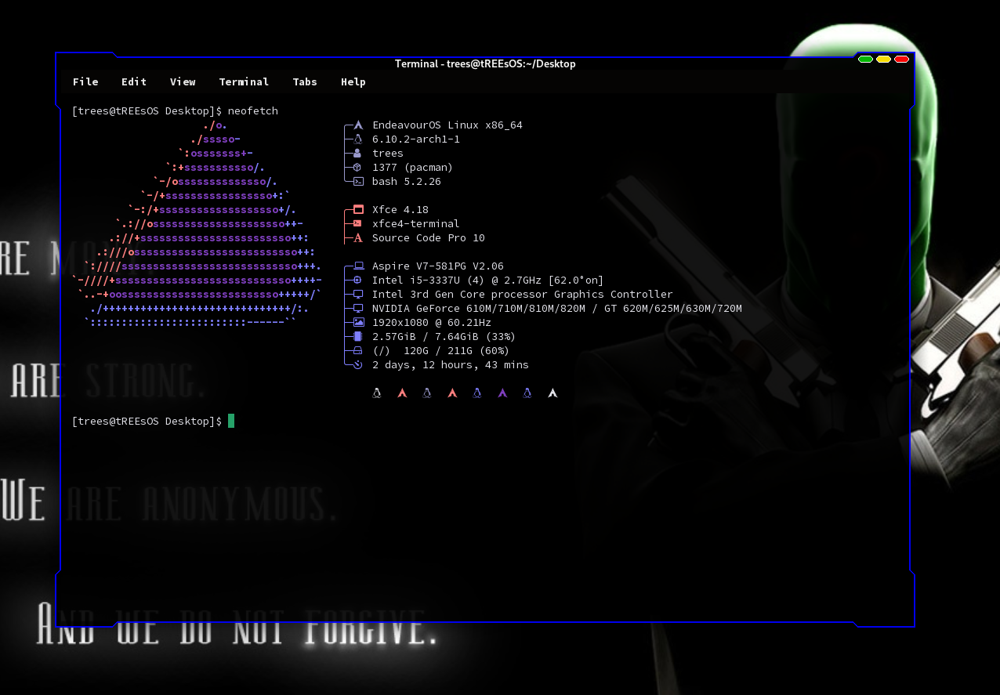

* CyberWM-Dark-DeepPurple
  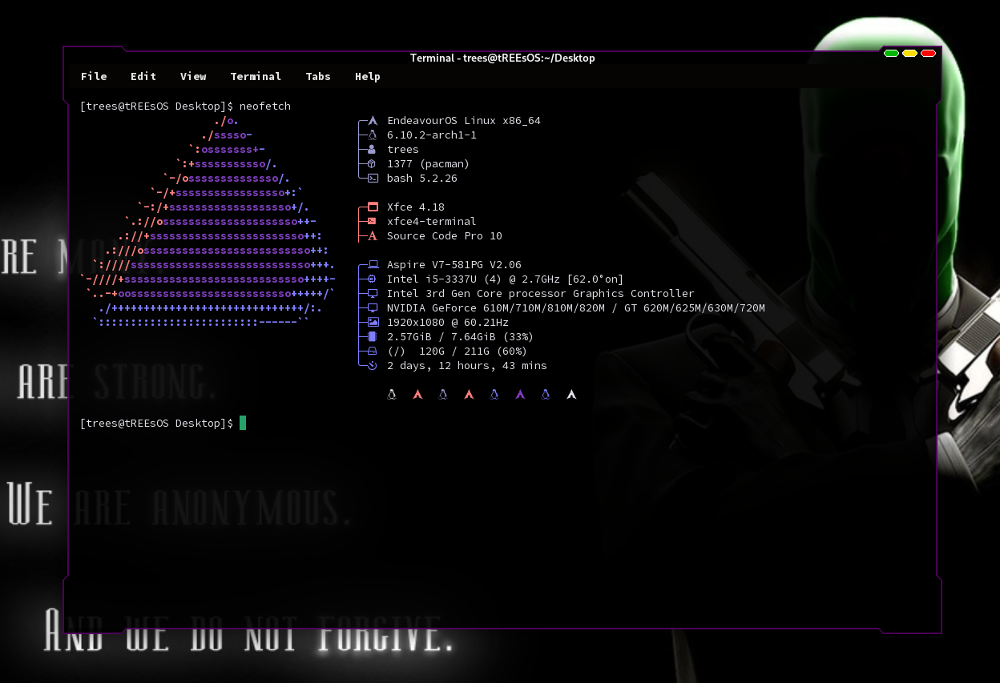

* CyberWM-Dark-Gray
  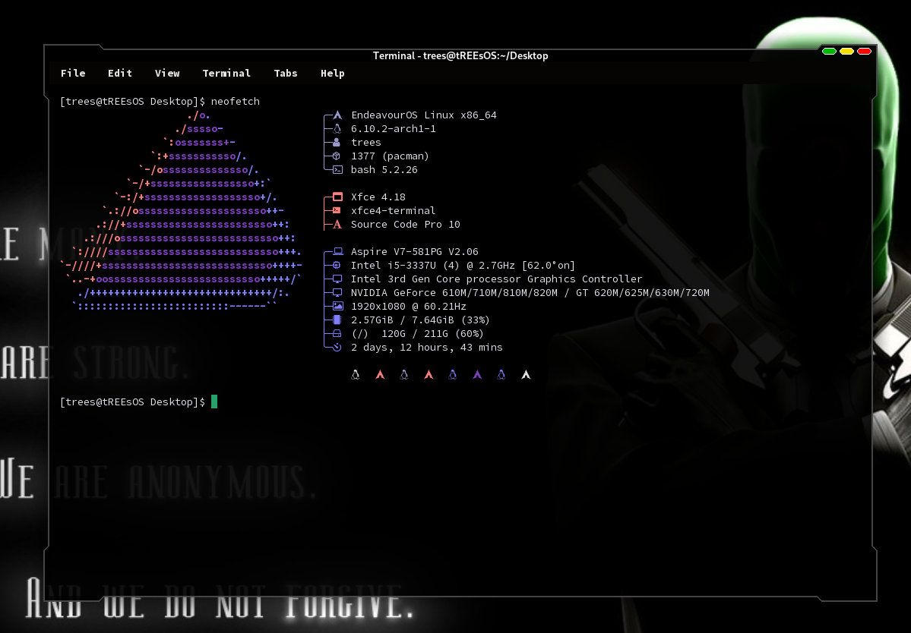
  
* CyberWM-Dark-Green
  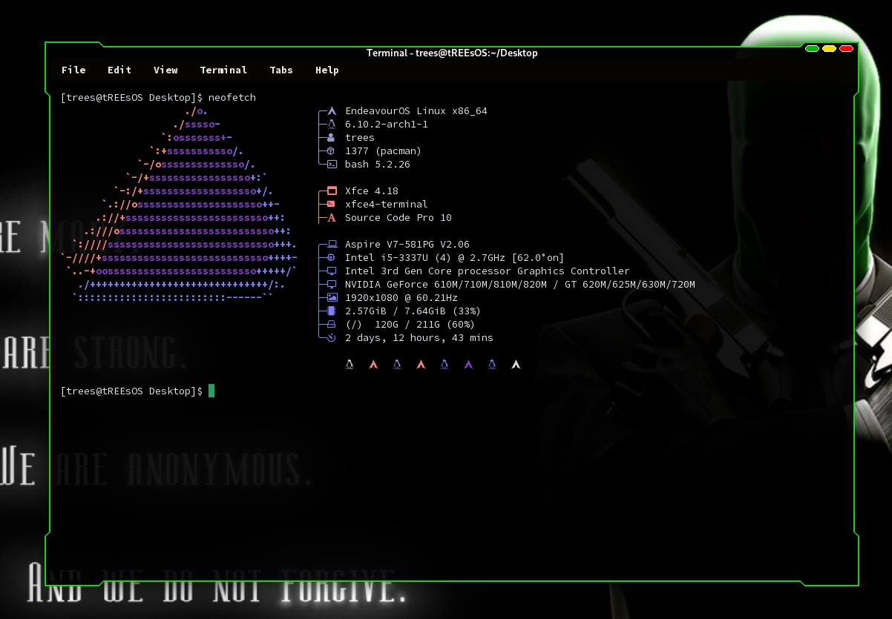

* CyberWM-Dark-LightBlue
  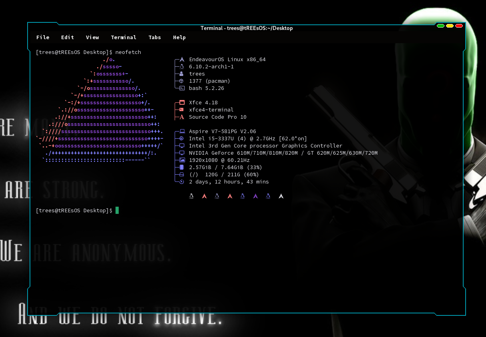

* CyberWM-Dark-LightPurple
  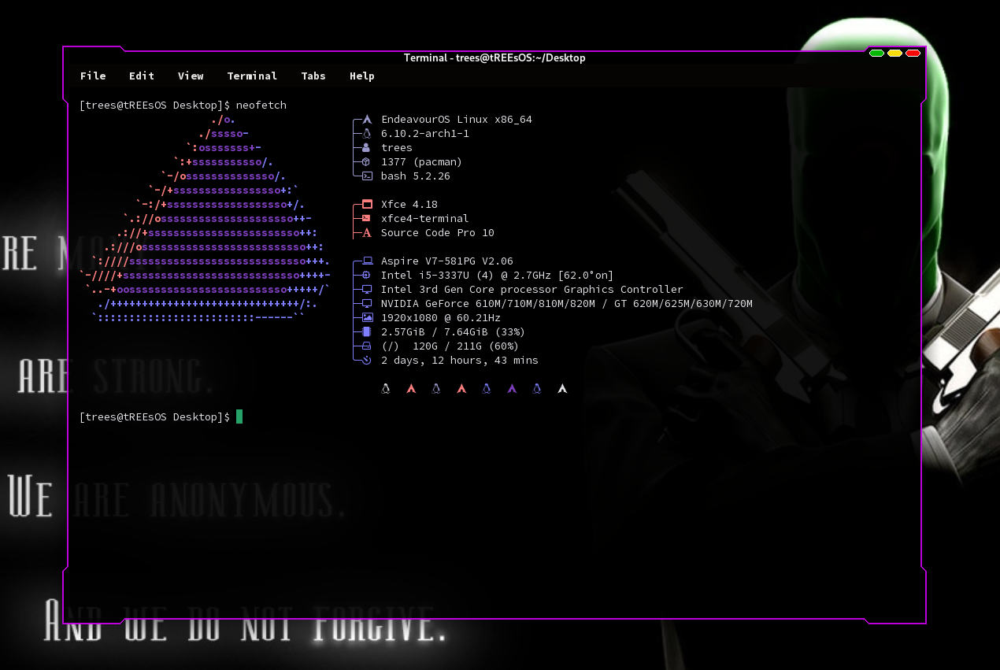

* CyberWM-Dark-Midnight (*All Black*)
  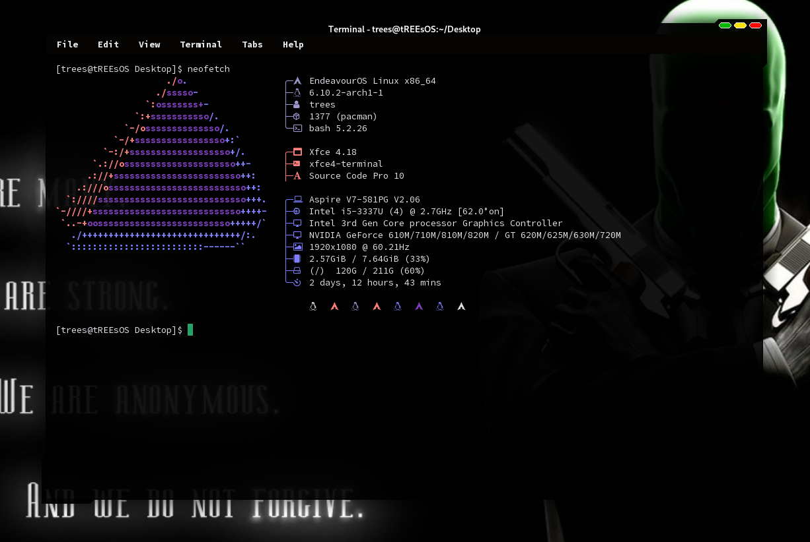

* CyberWM-Dark-Pink
  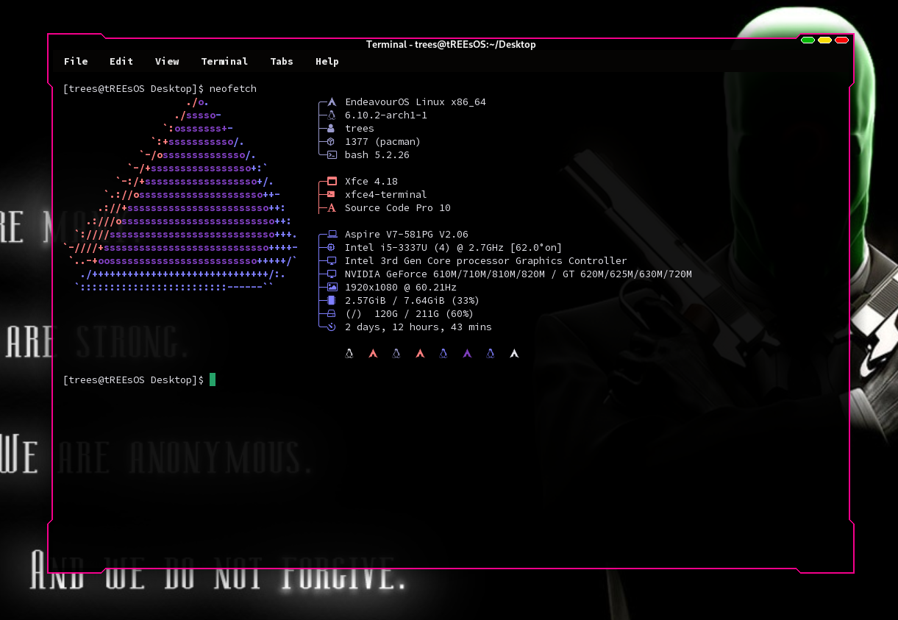

* CyberWM-Dark-Red
  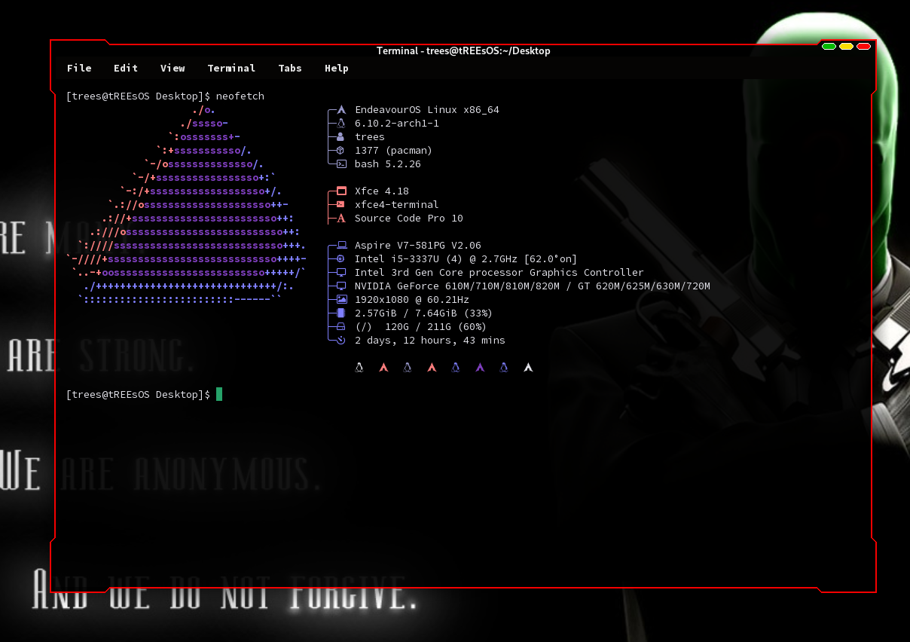

* CyberWM-Dark-White
  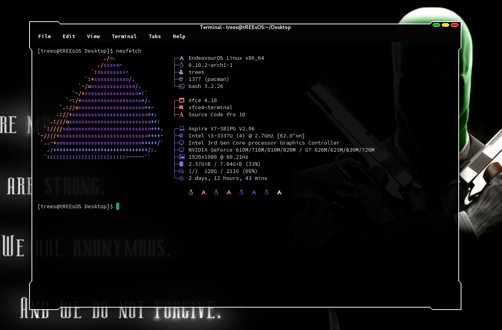

* CyberWM-Dark-Yellow
  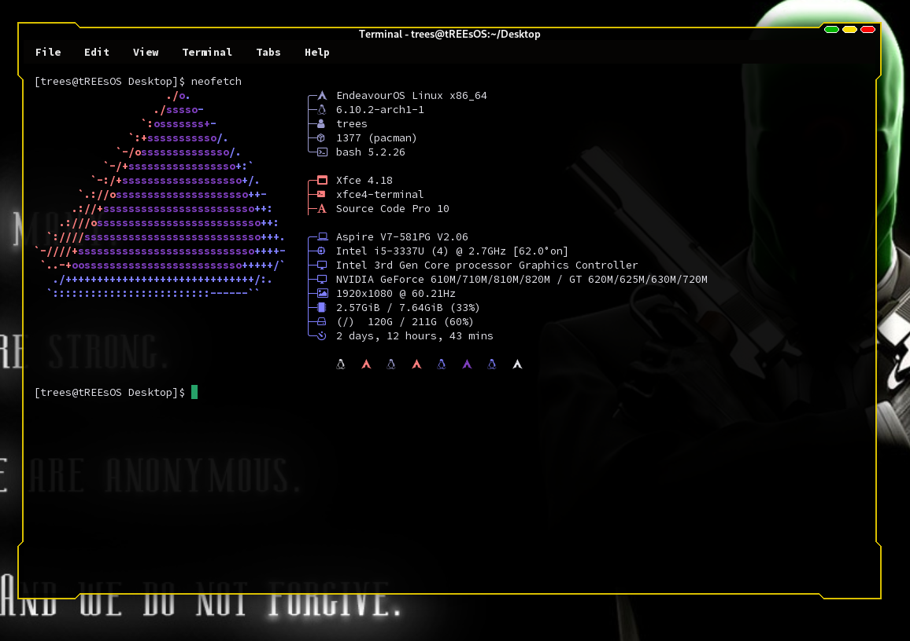

<!--- Section for Installation techniques and Explanation --->
## Installation
<!-- The Introduction tries to help users locate the correct path for the Installation --->
To Install  this theme collection. You will first need to know where your system stores XFCE Themes.

There are multiple ways to do this and it is up to the user to work out the correct path themselves.

Some common locations for theme configurations are:

* `/usr/share/themes/`
* `/usr/share/xfwm4/themes/`
* `~/.themes/`
* `~/.local/share/themes/`

For the purposes of this guide we will be installing to the most standard location. `/usr/share/themes/`
We will also assume you have knowledge of using `git` and basic system utilities.

<!--- This Section Signposts Users to different parts of the Installation Guide. --->
### Installation Options:
- [Installing the Full Theme Collection](#approach-1-installing-the-full-theme-collection)
- [Installing Individual Themes](#approach-2-installing-individual-themes)
- [Using your Theme](#using-your-theme)
- [Clean Uninstall](#how-to-uninstall-cleanly)

___

<!--- Guide for Approach: Installing the Full Theme Collection --->
### **APPROACH 1: INSTALLING THE FULL THEME COLLECTION**
This is the simplest approach to Installation and installs every color variant on your system.

1. First, clone this repository in a location of your choice.
   ```
   # Command 1 - Enter the Directory to store the repo files in.
   cd ~/Downloads

   # Use 'git' to clone the repository from Github.
   git clone https://github.com/tREEs-Repos/CyberWM-Dark
   ```

   You should see similar output to this:
   ```
   Cloning into 'CyberWM-Dark'...
   remote: Enumerating objects: 353, done.
   remote: Counting objects: 100% (353/353), done.
   remote: Compressing objects: 100% (108/108), done.
   remote: Total 353 (delta 257), reused 320 (delta 242), pack-reused 0 (from 0)
   Receiving objects: 100% (353/353), 3.21 MiB | 5.73 MiB/s, done.
   Resolving deltas: 100% (257/257), done.
   ```

2. Enter the Downloaded Repo and transfer all the root directory subfolders to your install location.
   ```
   # Enter the Downloaded Repository Directory
   cd CyberWM-Dark/ 
   ```

   You now have two options. If you want to transfer the themes directly without preserving the source use `mv`.

   This operation may need `sudo` permissions on some machines if moving files to the rootfs.
   ```
   # Move all Subfolders to /usr/share/themes.
   # This command only moves Directories beginning with CyberWM-Dark
   sudo mv -v CyberWM-Dark*/ /usr/share/themes
   ```

   If you are successful you should see output like this:
   ```
   renamed 'CyberWM-Dark-DeepBlue/' -> '/usr/share/themes/CyberWM-Dark-DeepBlue'
   renamed 'CyberWM-Dark-DeepPurple/' -> '/usr/share/themes/CyberWM-Dark-DeepPurple'
   renamed 'CyberWM-Dark-Gray/' -> '/usr/share/themes/CyberWM-Dark-Gray'
   ...
   ```

   If you wish to save a copy of the source files, then use the `cp` utility.

   This operation may need `sudo` permissions on some machines if copying files to the rootfs.
   ```
   # Copy all subfolders to /usr/share/themes
   # This command also only moves directories beginning with CyberWM-Dark
   sudo cp -rv CyberWM-Dark*/ /usr/share/themes
   ```

   If you are successful you should see output like this:
   ```
   'CyberWM-Dark-DeepBlue/' -> '/usr/share/themes/CyberWM-Dark-DeepBlue'
   'CyberWM-Dark-DeepBlue/README.md' -> '/usr/share/themes/CyberWM-Dark-DeepBlue/README.md'
   'CyberWM-Dark-DeepBlue/preview.png' -> '/usr/share/themes/CyberWM-Dark-DeepBlue/preview.png'
   ```

4. Your Theme is now Installed. Easy, right?
    
   Now start [using](#using-your-theme) it!

   Errors / Issues on our side? Please see the section on how to leave Feedback: [Bugs and Feedback](#bugs-and-feedback).

   Wish to uninstall? Please check [the Removal Guide](#how-to-uninstall-cleanly).
___

### APPROACH 2: INSTALLING INDIVIDUAL THEMES
Installing individual themes is more complicated but offers you more control over what files appear on your system.

To do this we use a combination of Gits 'sparse-checkout' feature combined with `git clone`.

In this example we are installing themes to the most common directory: `/usr/share/themes`

1. First Create a Directory for you to use for handling the source files.
   ```
   mkdir -v my_colors/
   ```

2. Initialize git within your workspace.
   ```
   cd my_colors/
   git init
   ```
   You will see what looks like an error for initializing an empty repository. Ignore this.

3. Add the Remote URL for the Cyber-WM Theme source code.
   ```
   git remote add origin https://github.com/tREEs-Repos/CyberWM-Dark.git
   ```

4. Fetch all of the objects in the Repository, but don't check them out.
   ```
   git fetch origin
   ```
   If this command is successful you will see output like as follows:
   ```
   remote: Enumerating objects: 356, done.
   remote: Counting objects: 100% (356/356), done.
   remote: Compressing objects: 100% (111/111), done.
   remote: Total 356 (delta 259), reused 320 (delta 242), pack-reused 0 (from 0)
   Receiving objects: 100% (356/356), 3.22 MiB | 5.96 MiB/s, done.
   Resolving deltas: 100% (259/259), done.
   ```

6. Enable 'sparse-checkout' to check out only specific directories.
   ```
   git sparse-checkout init --cone
   ```

7. Checkout which theme directories you want from the repo.
   ```
   git sparse-checkout set CyberWM-Dark-Midnight/ CyberWM-Dark-Green/ CyberwM-Dark-Red/
   ```

8. Now check out the branch that you want. (Always 'main' for CyberWM.)
   ```
   git checkout main
   ```

   You should expect to see the following output:
   ```
   branch 'main' set up to track 'origin/main'.
   Switched to a new branch 'main'
   ```
   
9. Check your workspace to ensure you have the colors of your choice.
    ```
    ls -al path/to/my_colors/
    ```
    If you followed all the steps correctly you will see your downloaded Theme files.

10. Ship the theme configs to the XFCE Themes directory.

    You have two options for moving the files.
    You can either use `mv` to move all the Downloaded Files directly.

    This command may require `sudo` depending on your setup / needs.
    ```
    # This Command Only moves folders called CyberWM-Dark
    sudo mv -v Cyber-WM-Dark*/ /usr/share/themes
    ```
    If the command is successful you will see the similar output:
    ```
    renamed 'CyberWM-Dark-DeepBlue/' -> '/usr/share/themes/CyberWM-Dark-DeepBlue'
    renamed 'CyberWM-Dark-DeepPurple/' -> '/usr/share/themes/CyberWM-Dark-DeepPurple'
    renamed 'CyberWM-Dark-Gray/' -> '/usr/share/themes/CyberWM-Dark-Gray'
    ```

    Or you can use 'copy', `cp` to copy the files and preserve the source.

    This command may require `sudo` depending on your setup / needs.
    ```
    sudo cp -rv CyberWM-Dark*/ /usr/share/themes
    ```
    If the command is successful you will see similar output:
    ```
    'CyberWM-Dark-DeepBlue/' -> '/usr/share/themes/CyberWM-Dark-DeepBlue'
    'CyberWM-Dark-DeepBlue/README.md' -> '/usr/share/themes/CyberWM-Dark-DeepBlue/README.md'
    'CyberWM-Dark-DeepBlue/preview.png' -> '/usr/share/themes/CyberWM-Dark-DeepBlue/preview.png'
    ...
    ```

11. Your themes are now Installed successfully and ready for use.

    Now start [using](#using-your-theme) it!

    Errors / Issues on our side? Please see the section on how to leave Feedback: [Bugs and Feedback](#bugs-and-feedback).

    Wish to uninstall? Please check [the Removal Guide](#how-to-uninstall-cleanly).
___

### USING YOUR THEME

___

### HOW TO UNINSTALL CLEANLY
___

<!--- Including a copy of the Creative Commons Zero License in the README for Transparency --->
## License
The CyberWM Theme Collection is Provided under the Creative Commons Zero License. 
A copy of the license is included below in full:

```
________________________________________________________________________________________
This license description applies to: "CyberWM-Dark XFCE Window Manager Themes" by tREEs
The full repository is available at this URL: https://github.com/tREEs-Repos/CyberWM-Dark
_________________________________________________________________________________________

____________________________________________________
CC0 1.0 Universal (CC0 1.0) Public Domain Dedication
____________________________________________________

The person who associated a work with this deed has dedicated the work to the public domain 
by waiving all of his or her rights to the work worldwide under copyright law, including all 
related and neighboring rights, to the extent allowed by law.

You can copy, modify, distribute, and perform the work, even for commercial purposes, all 
without asking permission. Full Copy of the legal code: 

https://creativecommons.org/publicdomain/zero/1.0/legalcode

By using this code repository you agree to be bound by the conditions of this license.
_________________________________________________________________________________________
```
A copy of the License will be cloned with the Repository. It is available .

<!--- Repository Acknowledgements --->
## Acknowledgements

**Purnomoshinigami** - An Indonesian user on XFCE Look.
He has some amazing Window Manager themes that seem to turn up on all my XFCE Builds.
Support him by checking out his  Account and seeing if theres anything you like.

**XFCE-Look.org** - 
A well known, leading source of configurations for XFCE, GTK, Compix, Beryl / Emerald Themes and more.
Support the website by checking it out and seeing if theres anything you like.
The XFCE-Look website is linked directly .

## Bugs and Feedback
Issues / Errors with this Repository? Reach out here via Github.

Feedback? Also feel free to reach out here via Github. Your input is always appreciated!

I am always open to requests to refactor and redesign this repository if you have a better system.
___
